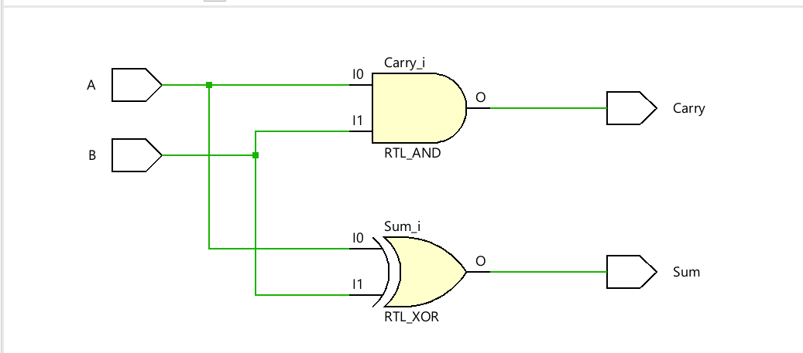
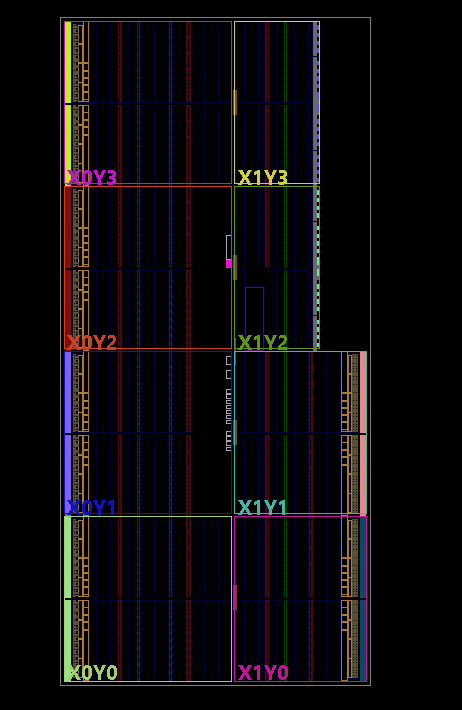
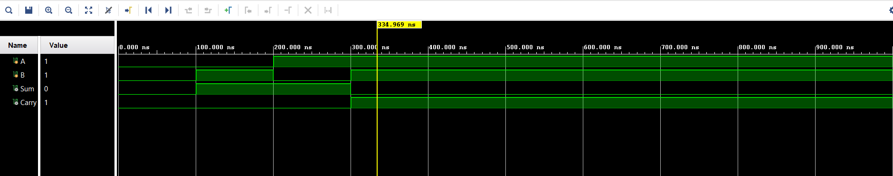

# Verilog Basics

Welcome to the **Verilog Basics** repository!

This repository contains implementations of fundamental digital design concepts using **Verilog HDL**, along with their corresponding **testbenches**, **simulation waveforms**, and **documentation**.

## 📂 Projects

- Half Adder
- Full Adder
- 2:1 Multiplexer (MUX)
- Decoder
- Encoder
- Comparator
- Arithmetic Logic Unit (ALU)

> More projects will be added as I continue learning Verilog.

## 🛠️ Tools Used

- Verilog HDL
- Xilinx Vivado
- Git & GitHub

## 📁 Repository Structure

```
Verilog-Basics/
│
├── rtl/
├── testbench/
├── waveforms/
├── images/
├── docs/
└── README.md
```

## 🎯 Objective

To strengthen my understanding of **Digital Design** and **RTL Design** by implementing fundamental circuits in Verilog and verifying them through simulation.

## 📌 Learning Outcomes

Through this repository, I aim to:

- Develop a strong foundation in Verilog HDL.
- Understand combinational and sequential digital circuits.
- Write efficient RTL code.
- Create and verify testbenches.
- Analyze simulation waveforms.
- Build a strong VLSI project portfolio.

---
## 📸 Simulation Results

### RTL Schematic



### RTL Layout



### Simulation Waveform



---

## 👩‍💻 Author

**Manasvi**

B.Tech – Electronics and Communication Engineering (VLSI)

KL University

Interested in Digital Design, RTL Development, FPGA Design, and VLSI.

---

⭐ This repository is part of my VLSI learning journey. More projects and improvements will be added as I continue exploring digital design and hardware development.
⭐ This repository is part of my VLSI learning journey. More projects and improvements will be added regularly.
